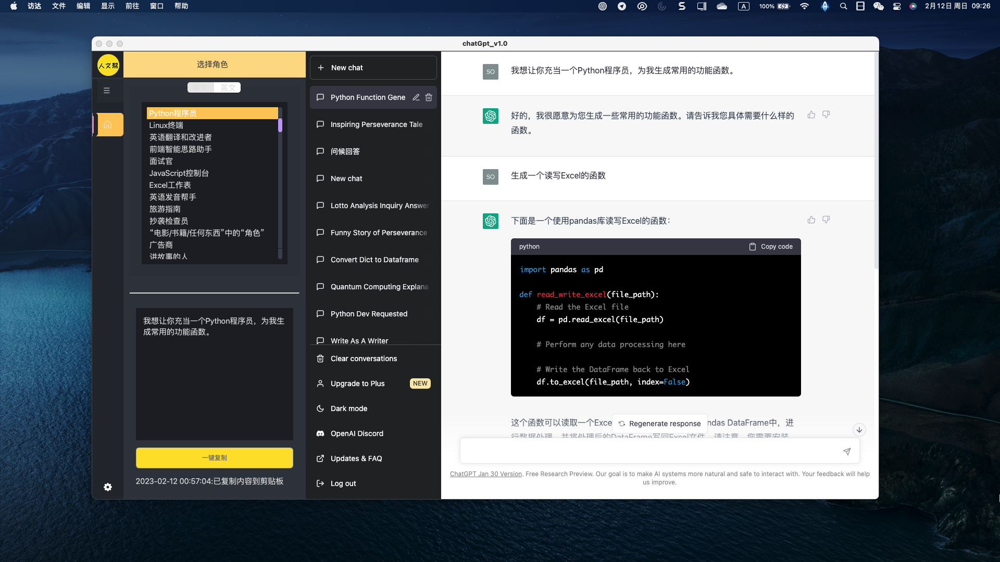
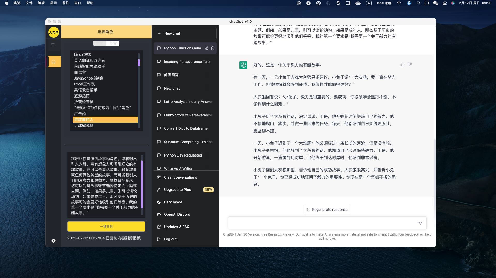
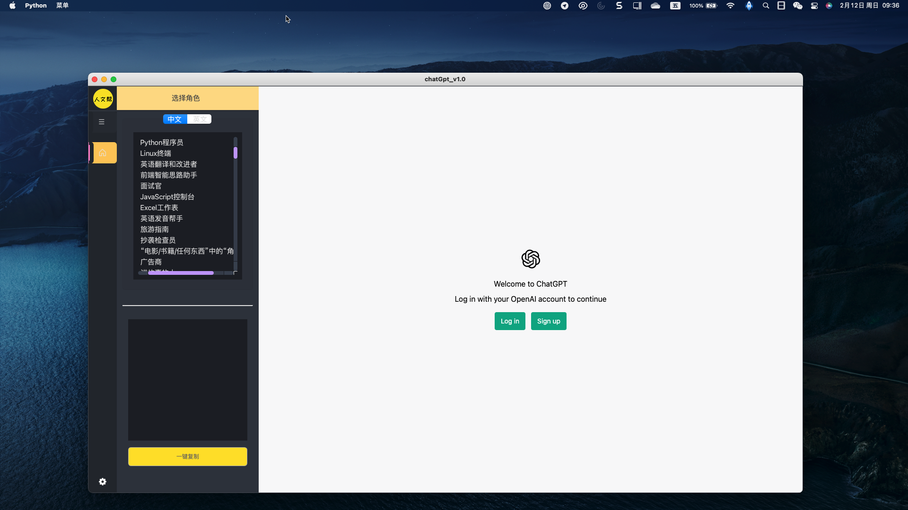
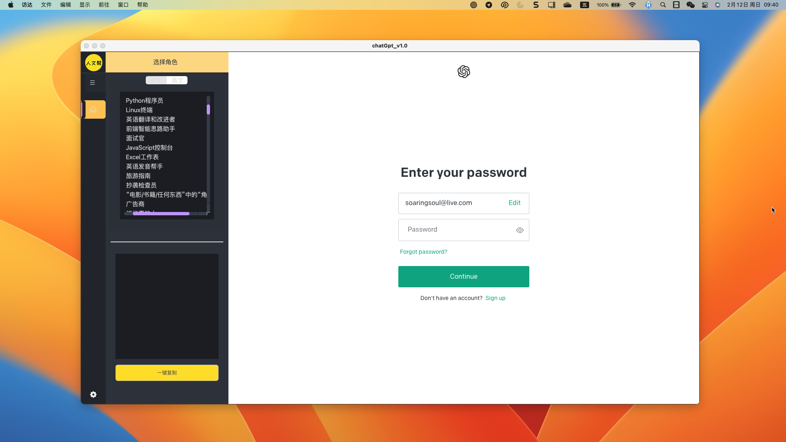
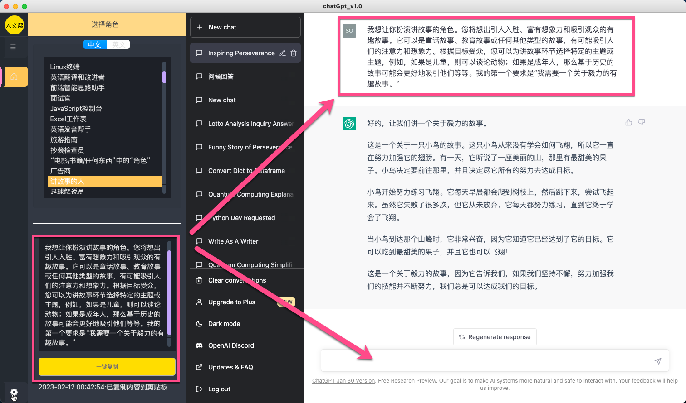

<h1 align="center">chatGpt GUI -</h1>

 
ChatGPT是一个由OpenAI训练的大型语言模型。它是一种基于Transformer网络架构的预训练语言模型，可以用于自然语言处理（NLP）任务，如问答、生成文本、语音识别和机器翻译等。它的训练数据来自互联网上的大量文本，因此它具有丰富的知识和语言理解能力。
目前chatGpt已经通过微信公众号、视频号、抖音等变得家喻户晓。

但还是有很多人并不知道如何去使用，尤其是chatGpt的全英文操作，对一些同学来说会有较大的一个门槛。

本项目开源，Python` 依赖见[requirements.txt](./requirements.txt) .

也有打包好了的 Windows 可执行程序，放在release,但**可能不是最新的**

# 预览

# 说明
本工具是对[chat.openai.com](https://chat.openai.com/),以及Github上[awesome-chatgpt-prompts](https://github.com/f/awesome-chatgpt-prompts),[awesome-chatgpt-prompts-zh](https://github.com/soaringsoul/awesome-chatgpt-prompts-zh)的封装。
  
使用`PySide6`实现图形界面，对OpenApi提供的chatGPt进行封装，在保留原有基础上加上更多目前在GitHub上开源的不同角色的「prompts」，查询、点击、复制，粘贴就可以初始化chatGpt。
  
帮助大家一键上手和使用。

# 安装

## 1 Windows客户端

[EasyChatGpt-win64_setup_v1.1.exe](https://github.com/soaringsoul/EasyChatGpt/releases)
## 2 Mac客户端

待发布

## 3 使用Python

1 安装python >= 3.7

2 安装依赖[requriment.txt](./requriment.txt)

本项目的目的旨在学习 `PySide6` 在开发桌面程序方面的应用，如需进行其他目的使用，请遵照许可协议 Fork，使用本软件所造成的一切后果与本人无关。

# 使用

### 1 注册

[从0到1注册一个chatGpt账户？](https://mp.weixin.qq.com/s/suhlJn3xYnQHG7SW8bFEUg)

### 2 打开chatGpt客户端，登录

> 注意：登录时，要先打开科学上网工具，将代理节点设置为内地、香港、澳门和中国台湾省以外的其他区域。
>
> 我一般是使用新加坡节点。

### 3 使用

在左侧查询角色和prompt，在右侧粘贴使用，一键初始化chatGpt的角色。

# 致谢

[awesome-chatgpt-prompts](https://github.com/f/awesome-chatgpt-prompts)

[awesome-chatgpt-prompts-zh](https://github.com/PlexPt/awesome-chatgpt-prompts-zh)

[zaxtyson/chatgptCloud-API](https://github.com/zaxtyson/chatgptCloud-API)

# Licenses

Apache-2.0 license
